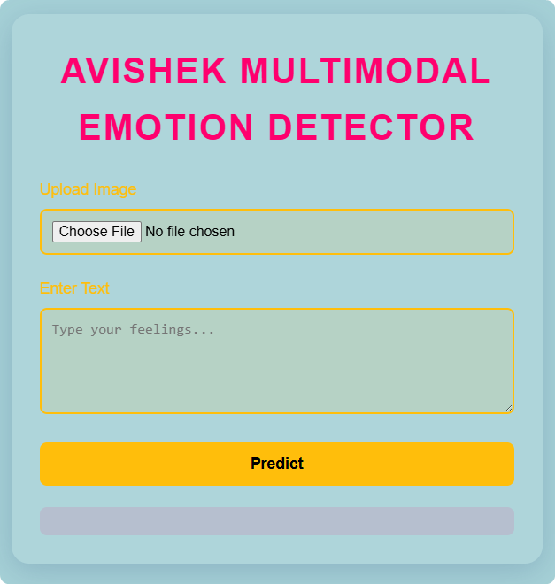
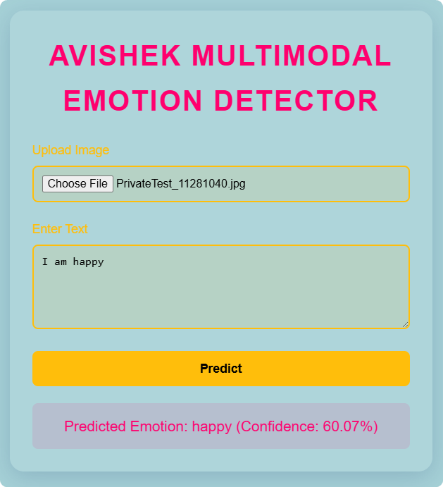

# Avishek-Multimodal-TextFace

A multimodal emotion detection web application that combines text sentiment analysis (LSTM model) with facial emotion recognition (CNN model) to predict emotions from uploaded images and text inputs. Built with Flask, TensorFlow/Keras, and a modern UI, this project was developed for a Multimedia course project in 2025.

## Demo



## Technologies

- **Backend**: Flask (Python web framework)
- **Models**:
  - **Text**: Bidirectional LSTM for 6-class emotion classification (sadness, joy, love, anger, fear, surprise) trained on a 16k emotion dataset.
  - **Facial**: CNN for 7-class FER2013 dataset (angry, disgust, fear, happy, neutral, sad, surprise).
  - **Fusion**: Late fusion by averaging probabilities, mapped to 5 common emotions (angry, fear, happy, sad, surprise).
- **Frontend**: HTML/CSS/JS with a modern glassmorphism design using colors #ffbe0b (amber), #ff006e (rose), and #3a86ff (azure).
- **Dependencies**: TensorFlow 2.15, Keras, NumPy, Pillow, (optional NLTK for stopwords, replaced with minimal list).

## Setup Instructions

1. **Clone the Repository**:
   ```bash
     git clone https://github.com/yourusername/Avishek-Multimodal-TextFace.git
   ```
   ```bash
   cd Avishek-Multimodal-TextFace
   ```
2. **Create a Virtual Environment** (optional but recommended):
   ```bash
   python -m venv venv
   source venv/bin/activate  # On Windows: venv\Scripts\activate
   ```
3. **Install Dependencies**:

   ```bash
   pip install -r requirements.txt
   ```

   _Note_: If issues arise (e.g., numpy compatibility or tensorflow), use `requirements.txt` with pinned versions:

   ```text
   flask==2.3.2
   tensorflow==2.17.0
   keras==3.3.3
   numpy==1.26.4
   pillow==10.4.0
   ```

4. **Download Pre-trained Models**:

   - Place the pre-trained LSTM and CNN model files `text_emotion_model.h5`, `facial_emotion_model.h5`, and `text_tokenizer.pickle` to the root directory (if you use your own model).

5. **Run the Application**:
   ```bash
   python app.py
   ```
6. **Access the Web App**:
   - Open your browser and go to `http://localhost:5000`
7. **Upload an Image and Enter Text**:

   - Upload a face image and enter text to see the emotion prediction.

## If run correctly, the web app would show like this:



## Project Structure

```Avishek-Multimodal-TextFace/
└── multimodal_emotion_app/
    ├── app.py
    ├── facial_emotion_model.h5
    ├── PrivateTest_10131363.jpg
    ├── PrivateTest_11149326.jpg
    ├── PrivateTest_11251019.jpg
    ├── PrivateTest_11281040.jpg
    ├── PrivateTest_12400594.jpg
    ├── PrivateTest_14494003.jpg
    ├── README.md
    ├── requirements.txt
    ├── text_emotion_model.h5
    ├── text_tokenizer.pickle
    ├── __pycache__/
    │   └── random.cpython-312.pyc
    ├── templates/
    │   └── index.html
    └── static/
        └── uploads/
            └── PrivateTest_11251019.jpg
```

## Usage

- Upload a clear black & white image of a face (JPEG/PNG). Download from `fer2013` dataset or use your own.
- Enter a text snippet expressing an emotion.
- Click "Predict" to see the combined emotion prediction from both modalities.

## Acknowledgements

- Datasets: [FER2013](https://www.kaggle.com/datasets/msambare/fer2013), [Emotion Dataset](https://www.kaggle.com/datasets/praveengovi/emotions-dataset-for-nlp)
- Libraries: [Flask](https://flask.palletsprojects.com/), [TensorFlow](https://www.tensorflow.org/), [Keras](https://keras.io/), [NumPy](https://numpy.org/), [Pillow](https://python-pillow.org/)
- Inspiration: Multimedia course project in Level-4 Term-I at [CUET](https://www.cuet.ac.bd)

### Give a star if you find this project useful! ⭐
